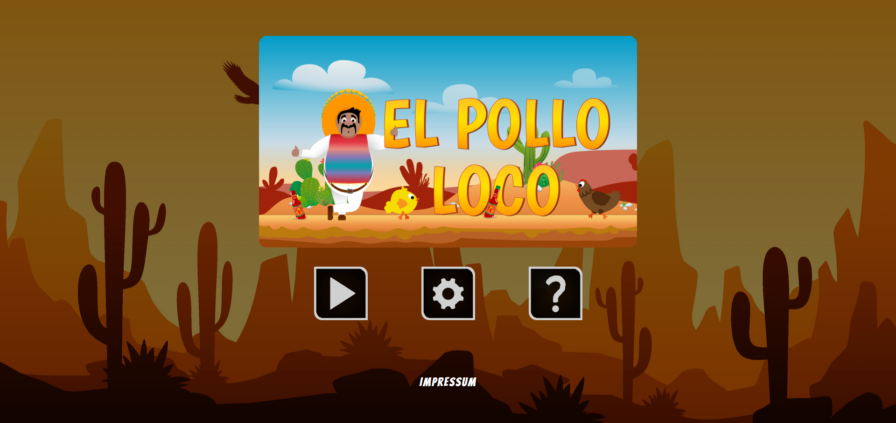
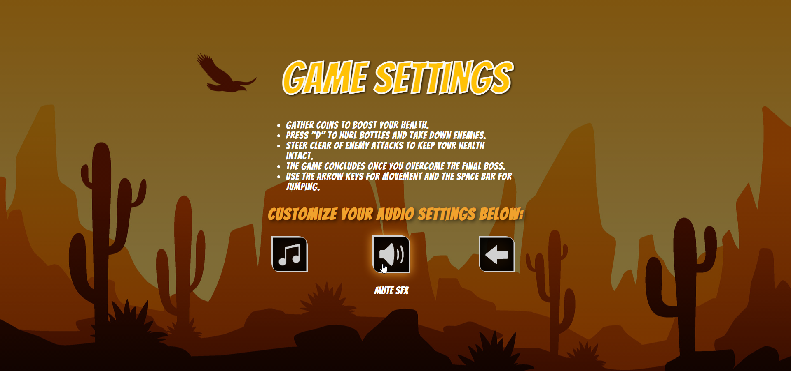
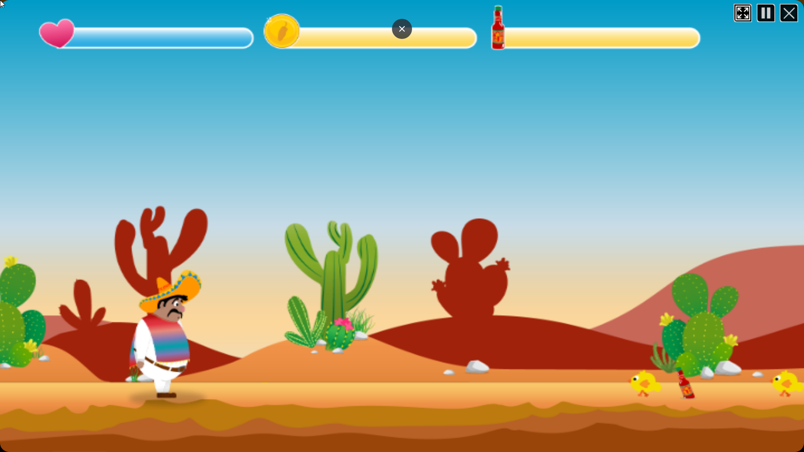
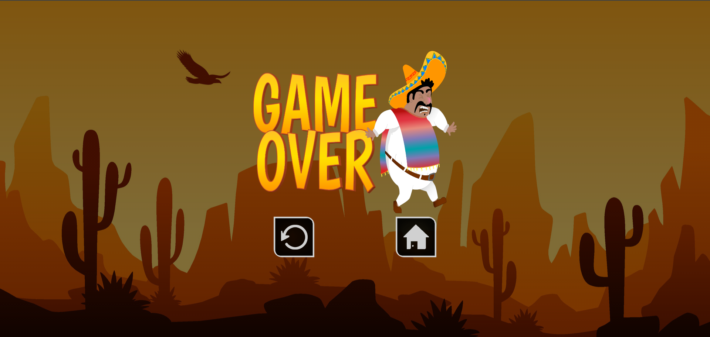

# El Pollo Loco – 2D Browser Game

A lightweight 2D side-scrolling jump’n’run game for the browser – built with **Vanilla JavaScript**, **HTML5 Canvas**, and object-oriented design. Collect coins & bottles, dodge enemies, throw bottles at the final boss, and save the day 🐔💥


**🎮 Live Demo:** [El Pollo Loco](https://abbas-el-mahmoud.com/elpolloloco/index.html) 

## Table of Contents
- [Features](#features)
- [Controls](#controls)
- [Quick Start](#quick-start)
- [Using a Node Mini Server](#using-a-node-mini-server)
- [Folder Structure](#folder-structure)
- [Tech Stack](#tech-stack)
- [Build/Deployment](#builddeployment)
- [Screenshots](#screenshots)
- [Roadmap](#roadmap)
- [Author & License](#author--license)

---

## Features
- 🎮 **Smooth Platforming**: Running, jumping, falling, collision detection
- 🧠 **OOP Structure**: Separate classes for characters, enemies, items, and the world
- 🪙 **Collectibles**: Coins & bottles with inventory/progress tracking
- 🧪 **Throw Mechanic**: Throw bottles at enemies and the boss
- 🔊 **Sound Effects & Music** (mute toggle)
- 📱 **Responsive Canvas** (scales up to fullscreen)
- ⚡ **No frameworks** – pure JavaScript + Canvas

## Controls
| Action | Key |
|---|---|
| Move left/right | **← / →** or **A / D** |
| Jump | **Spacebar** |
| Throw bottle | **F** or **E** |
| Toggle sound (if available) | **M** |

> Tip: On mobile devices, on-screen buttons are usually displayed.


## Quick Start
No build process needed – it’s a pure frontend app.

```bash
# 1) Clone the repository
git clone https://github.com/AbbasEl11/El-Pollo-Loco.git
cd El-Pollo-Loco

# 2) Start (simply open index.html in your browser)
#   - double-click index.html
#   - or use the VS Code "Live Server" extension
```

## Using a Node Mini Server
If your browser blocks local file access (audio/CORS), start a small server:

```bash
# Option A: http-server (recommended)
npm i -g http-server
http-server . -p 8080
# -> open http://localhost:8080

# Option B: Python (if installed)
# Python 3
python -m http.server 8080
# Python 2
python -m SimpleHTTPServer 8080
```

## 📂 Folder Structure
> Structure may vary slightly – adjust names if needed.

```
El-Pollo-Loco/
├── audio/ # Sound effects & background music
│ ├── backgroundmusic.mp3
│ ├── bottle.wav
│ ├── button-click.mp3
│ ├── character-dies.mp3
│ ├── chicken-cries.mp3
│ ├── coin.mp3
│ ├── endboss-cries.mp3
│ ├── explosion.mp3
│ ├── gameover.wav
│ ├── hit.wav
│ ├── jump.wav
│ ├── level-complete.mp3
│ ├── throw.wav
│ └── win-game.mp3
│
├── fonts/ # Custom fonts
│ ├── Bangers-Regular.ttf
│ └── RockSalt-Regular.ttf
│
├── img/ # All game graphics & sprites
│ ├── 1_editables/ # Editable Illustrator (.ai) files
│ ├── 2_character_pepe/ # Player animations (idle, walk, jump, hurt, dead)
│ ├── 3_enemies_chicken/ # Enemy chicken sprites (normal & small)
│ ├── 4_enemie_boss_chicken/ # Endboss animations (walk, alert, attack, hurt, dead)
│ ├── 5_background/ # Background images & layers
│ ├── 6_salsa_bottle/ # Bottle assets & splash animation
│ ├── 7_statusbars/ # Status bar icons & elements
│ ├── 8_coin/ # Coin sprites
│ ├── 9_intro_outro_screens/ # Start & Game Over screens
│ ├── assets/ # Miscellaneous images
│ ├── SquareButtons/ # UI button icons
│ └── You won, you lost/ # Win/Lose screen variations
│
├── levels/ # Level definitions
│ ├── level1.js
│ ├── level2.js
│ └── level3.js
│
├── models/ # Game classes (OOP)
│ ├── background-object.class.js
│ ├── bottle.class.js
│ ├── character.class.js
│ ├── chicken.class.js
│ ├── clouds.class.js
│ ├── coin.class.js
│ ├── collisions.js
│ ├── drawable-object.class.js
│ ├── endboss.class.js
│ ├── keyboard.class.js
│ ├── level.class.js
│ ├── movable-object.class.js
│ ├── smallchicken.class.js
│ ├── sound-manager.js
│ ├── status-bar.class.js
│ ├── throwable-object.class.js
│ └── world.class.js
│
├── screenshots/ # In-game screenshots for README
│ ├── ElPolloLoco-FullScreen.png
│ ├── ElPolloLoco-Game-Over.png
│ ├── ElPolloLoco-Game.png
│ ├── ElPolloLoco-Home.png
│ └── ElPolloLoco-Settings.png
│
├── scripts/ # Main game logic scripts
│ ├── audio.js
│ └── game.js
│
├── styles/ # CSS stylesheets
│ ├── fonts.css
│ ├── menu.css
│ ├── responsive.css
│ └── style.css
│
├── .gitignore
├── index.html # Game entry point
├── LICENSE
└── README.md
```

## Tech Stack
- **JavaScript (ES6+)**
- **HTML5 Canvas**
- **CSS3**
- Optional: small **Node/static server** for local development

## Build/Deployment
- **GitHub Pages** (recommended):  
  1. Go to your repository settings → **Pages**  
  2. Select branch `main` + `/ (root)`  
  3. Wait for the provided URL to be active (cache ~1–2 min)
- Alternatively: any static hosting service (Netlify, Vercel, Surge, …)

## Screenshots

**EL POLLO LOCO**








```html
<!-- Example -->
<p align="center">
  
</p>
```

## Roadmap
- [ ] Pause menu / settings
- [ ] Improve touch controls
- [ ] Save highscore/progress (LocalStorage)
- [ ] Accessibility (color/audio cues)


## Author
Developed by [AbbasEl11](https://https://github.com/AbbasEl11)


